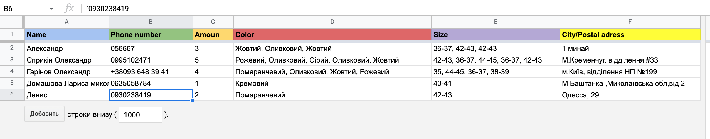

# Toptapki bot

---
### Bot for ordering shoes

---
This bot was created for ordering shoes. To make an order you need to enter your name and surname, phone number, chose amount of goods with buttons, chose the color with buttons and enter the postal address where you want your purchase to be delivered, after that all the information goes to Google Sheets the way shown on the picture.

---
To install requirements run:

`pip install -r requirements.txt`

---

Copy file `example.env` into `.env` and replace `TOKEN` with your token from the Telegram and `CREDENTIALS` with your credentials from Google Sheets.

---

To run:

`python main.py`

---
Google Sheet example:

---
Telegram bot link

https://t.me/TopTapkiBot
